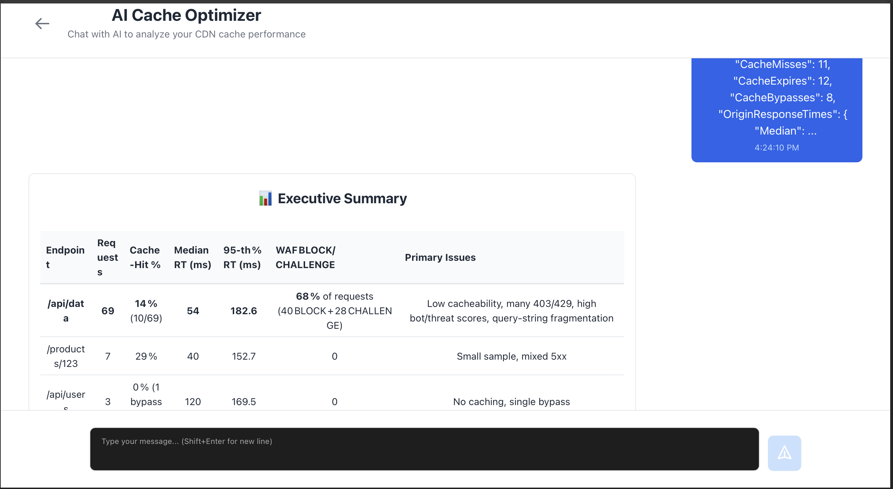

# Cloudflare AI Cache Optimizer

A Cloudflare Workers and Pages application for AI analysis of Cloudflare HTTP logs.



Currently deployed live here: https://wandering-brook-d1cc.pages.dev

### How It Works
*Note:* Cloudflare's production HTTP logs contain far more fields than this application handles, so please use the example logs, which contain only the relevant fields. This application would still provide accurate results if production HTTP logs were trimmed to consist of only the required fields.

1. **Upload HTTP logs in JSON format** - Users can upload their own Cloudflare HTTP logs or download pre-built example datasets (cache misses, DDoS attacks, normal traffic) directly from the deployed site for immediate testing

2. **Statistical aggregation via Cloudflare Worker** - The Worker performs log aggregation by endpoint URL, calculating cache performance metrics (hit/miss rates, bypasses), response time percentiles (p50/p95/p99), origin server health by IP, security metrics (WAF actions, bot/threat scores), ASN distribution, and query parameter caching impact

3. **AI-powered analysis with Workers AI** - Aggregated metrics are sent to Cloudflare's Workers AI (@cf/openai/gpt-oss-120b model) which identifies performance bottlenecks, cache optimization opportunities, origin server issues, and security threats

4. **Interactive chat interface** - The AI's analysis is presented in a conversational UI where users can ask follow-up questions about their CDN performance, dive deeper into specific metrics, and receive actionable recommendations with full conversation context maintained across messages

5. **Service-bound architecture** - Pages Functions proxy all API requests to the Worker via Cloudflare service bindings, demonstrating a production-ready pattern for connecting frontend and backend without exposing Worker URLs or managing CORS

## Quickstart

### Prerequisites

- **Node.js** 18+ (tested with 20.15.1)
- **npm** 10+
- **Cloudflare Account** with Workers AI enabled
  - [Sign up for Cloudflare](https://dash.cloudflare.com/sign-up)
- **Wrangler CLI** for deployment
  - Install: `npm install -g wrangler`
  - [Documentation](https://developers.cloudflare.com/workers/wrangler/install-and-update/)

### Installation

This is a monorepo with separate dependencies for the Worker backend and Pages frontend.

```bash
# Clone the repository
git clone <your-repo-url>
cd cf_ai_cache_optimizer

# Install Worker dependencies
cd workers
npm install

# Install Pages/frontend dependencies
cd ../web
npm install

# Authenticate with Cloudflare (first time only)
npx wrangler login
```

## Local Deployment
Run both Worker and Pages locally for faster iteration.

1. **Terminal 1 - Run Worker locally:**
   ```bash
   cd workers
   npx wrangler dev --port 8787
   ```

2. **Terminal 2 - Run Pages with local Worker binding:**
   ```bash
   cd ../web
   npm run build
   npx wrangler pages dev dist --service WORKER_API=cf-ai-cache-optimizer --port 8789
   ```

3. **Open your browser:**
   Navigate to `http://localhost:8789`


## Cloud Deployment

### Deploy Worker

```bash
cd workers
npx wrangler deploy
```

The Worker will be deployed to: `https://cf-ai-cache-optimizer.<your-subdomain>.workers.dev`

### Deploy Pages

```bash
cd ../web
npm run deploy
```

## License

MIT
